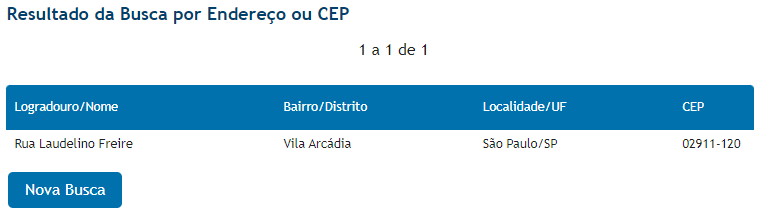
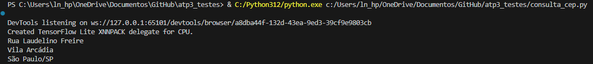

# ATP 3 - Pesquisa de CEP

Usando o Selenium pesquisar um endereço qualquer e\n
mostrar no terminal o resultado da pesquisa, armazenando\n
em variáveis o endereço, bairro e cidade.

# Bibliotecas usadas
 * Selenium
 * time
 * webdriver manager

# Resultado esperado

# Resultado obtido via terminal
